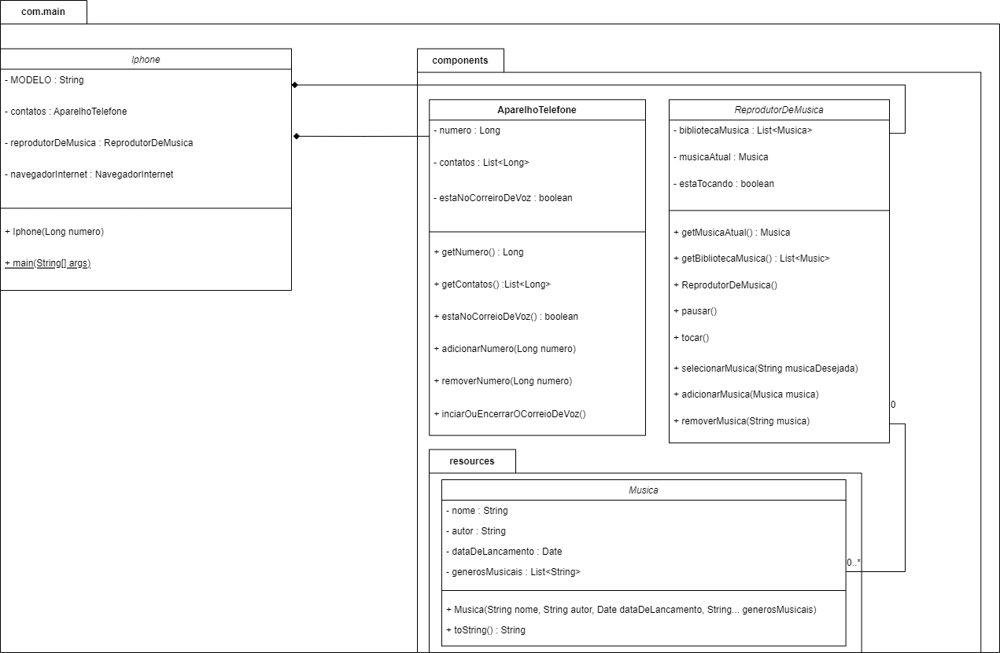

# Projeto da DIO
## Orientação a Objetos e UML: Diagramação de Classes do IPhone
### Finalidade

Esse projeto tem como objetivo servir como uma introdução ao design orientado a objetos e diagramação UML

Feito por: Pedro Henrique de Oliveira

---
#### Componentes nescessário para usar
JDK >= 1.8

---
### Imagem do diagrama
